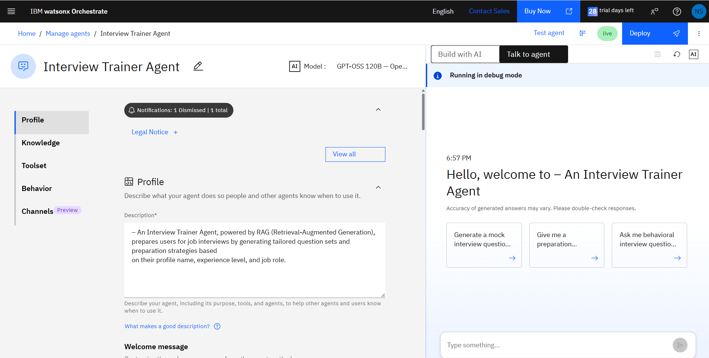
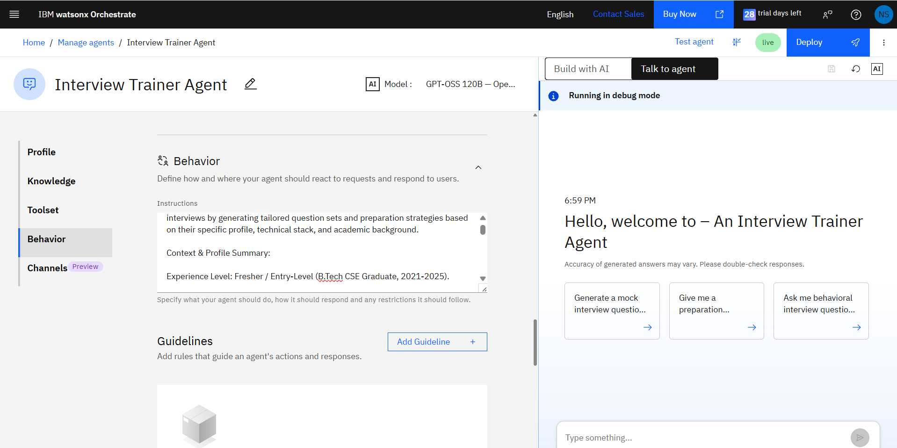
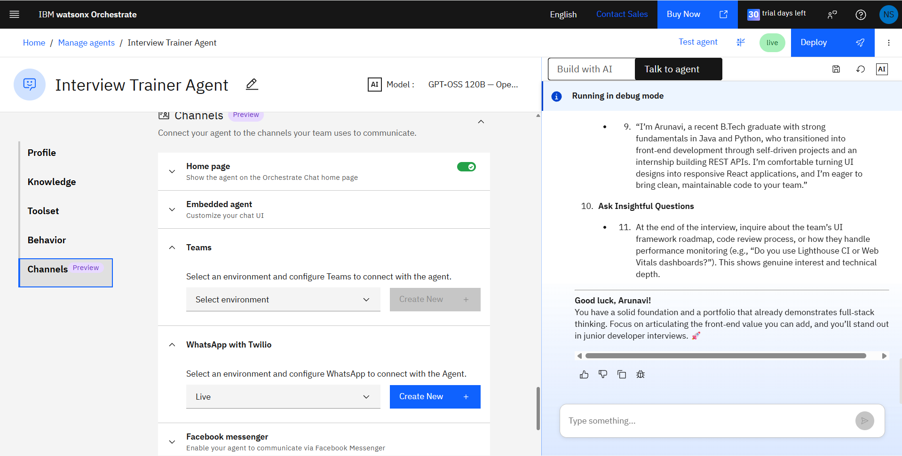
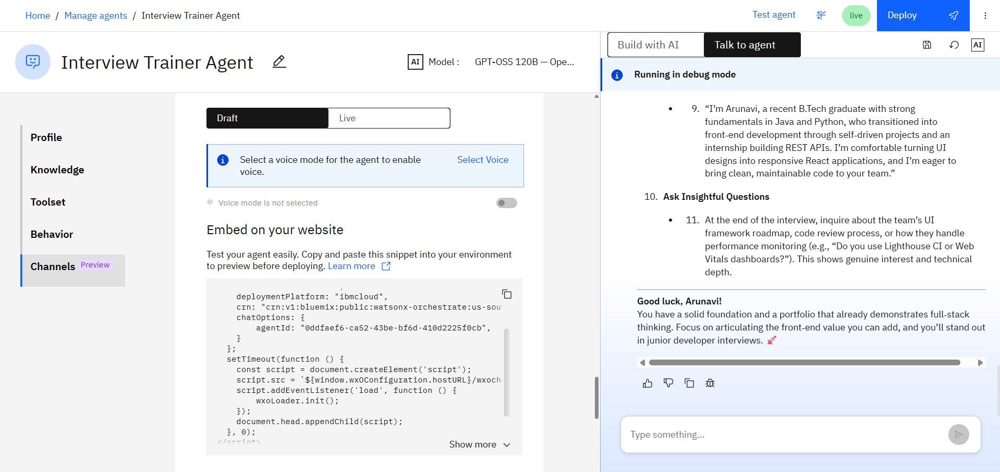

# Interview Trainer Agent

## Overview

The Interview Trainer Agent is an AI-powered virtual interview assistant built using IBM watsonx Orchestrate. It helps users prepare for interviews by generating personalized responses based on their uploaded resume.

## Features

- Resume-based interview preparation
- HR and technical interview questions
- AI-powered personalized responses
- Professional communication
- IBM watsonx Orchestrate integration
- Retrieval-Augmented Generation (RAG)

## Tech Stack

- IBM watsonx Orchestrate
- GPT-OSS 120B
- IBM Cloud
- PDF Knowledge Source
- RAG

## Project Structure

```text
Interview-Trainer-Agent/
│
├── README.md
├── app.json
├── .gitignore
├── ibm-credentials.env.txt
├── Interview_Trainer_Agent_Problem_Statement.pdf
├── Interview_Trainer_Agent_Presentation.pptx
├── demo-video-link.md
└── screenshots/
```

## Screenshots

### Agent Profile



### Behavior Instructions



### Deployment Status



### Demo Conversation



### Resume Upload


## Demo Video

The project demonstration video link is available in `demo-video-link.md`.

## Author

**Naveena Sandhi**
